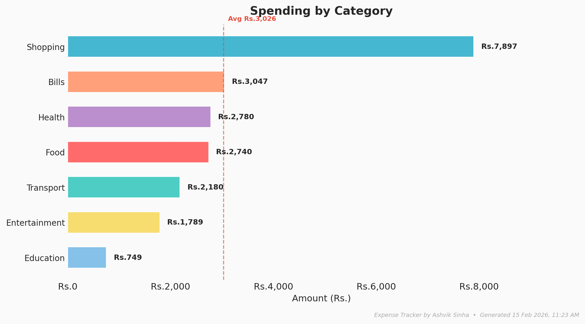
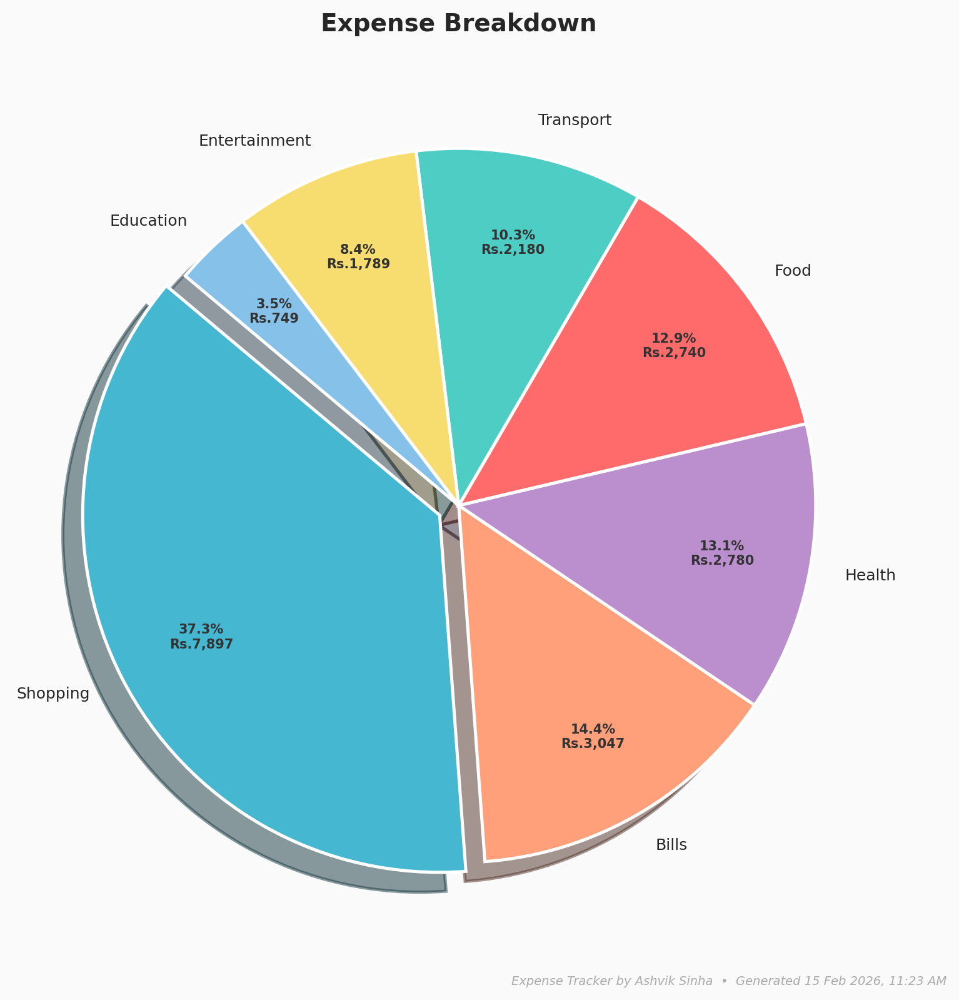
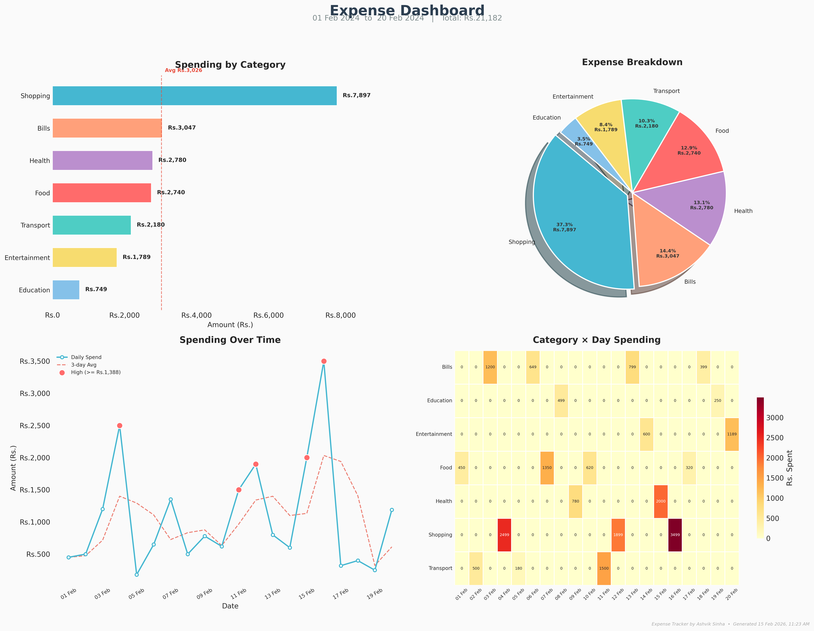

# 💸 Expense Tracker — Auto-categorize & Visualize Spending

> **Portfolio Piece #2** — Demonstrates data processing, keyword-based classification, rich terminal UI, and professional data visualization with Python.

---

## ✨ What It Does

| Feature | Detail |
|---|---|
| **Rich Terminal UI** | Beautiful tables, progress bars, spinners, and colour-coded output via [Rich](https://github.com/Textualize/rich) |
| **Interactive Menu** | 6-option menu loop — load, view, chart, export, customize, exit |
| **Auto-categorize** | Classifies uncategorized expenses into 8 categories using keyword matching |
| **Summary report** | Styled panels with total spent, per-category breakdown (with inline bars), and top 5 expenses |
| **Professional Dashboard** | 2×2 grid combining bar, pie, trend, and heatmap charts — saved at 300 dpi |
| **Bar chart** | Horizontal bars sorted by amount with average-spending line |
| **Pie chart** | Exploded largest slice, showing both percentages and amounts |
| **Time-trend chart** | Daily spending line with 3-day moving average and highlighted high-spend days |
| **Heatmap** | Category × Day spending intensity (seaborn) |
| **CSV export** | Saves cleaned, categorized data to a new CSV |
| **Custom rules** | Add your own keyword → category mappings at runtime |

---

## 🚀 Quick Start

### 1. Install dependencies

```bash
pip install -r requirements.txt
```

### 2. Run the interactive tracker

```bash
python main.py
```

### 3. Or pre-load a specific CSV

```bash
python main.py path/to/your_expenses.csv
```

---

## 🖥️ Interactive Menu

```
  ┌──────────────────────────────────────────┐
  │            Main Menu                     │
  ├──────────────────────────────────────────┤
  │  [1]  Load & categorize expenses         │
  │  [2]  View summary statistics            │
  │  [3]  Generate charts                    │
  │  [4]  Export categorized CSV             │
  │  [5]  Add custom category rules          │
  │  [6]  Exit                               │
  └──────────────────────────────────────────┘
  Select option [1/2/3/4/5/6]:
```

- **Option 1** — Prompts for a CSV file, loads it with a progress bar, auto-categorizes, and shows the summary.
- **Option 2** — Re-displays the summary with styled tables anytime.
- **Option 3** — Renders all 4 chart types + a combined dashboard and saves PNGs.
- **Option 4** — Exports the categorized DataFrame to `output/categorized_expenses.csv`.
- **Option 5** — Add custom keyword → category rules (persists for the session).
- **Option 6** — Exit.

---

## 📁 Project Structure

```
expense-tracker/
├── main.py                  # Main script (Rich UI + charts + menu loop)
├── sample_expenses.csv      # 20-row sample dataset
├── requirements.txt         # pandas, matplotlib, seaborn, numpy, rich
├── .gitignore
├── LICENSE
├── README_EXPENSE_TRACKER.md
└── output/                  # Generated after first run
    ├── categorized_expenses.csv
    ├── category_chart.png   # Individual bar chart
    ├── pie_chart.png        # Individual pie chart
    └── dashboard.png        # 2×2 combined dashboard (300 dpi)
```

---

## 📄 CSV Format

Your input file needs these columns (header row required):

| Column | Required | Notes |
|---|---|---|
| `Date` | ✅ | Any common date format (`YYYY-MM-DD`, `DD/MM/YYYY`, etc.) |
| `Description` | ✅ | Free text — used for auto-categorization |
| `Amount` | ✅ | Numeric value (no currency symbols) |
| `Category` | ❌ | Leave blank for auto-categorization, or pre-fill to skip |

**Example:**

```csv
Date,Description,Amount,Category
2024-02-01,Swiggy order,450,
2024-02-02,Metro card recharge,500,
2024-02-03,Electricity bill,1200,Bills
```

---

## 🏷️ Categories & Keywords

| Category | Emoji | Matched Keywords |
|---|---|---|
| **Food** | 🍔 | restaurant, cafe, swiggy, zomato, grocery, meal, pizza, burger … |
| **Transport** | 🚗 | uber, ola, petrol, metro, bus, parking, cab, fuel, train … |
| **Shopping** | 🛍️ | amazon, flipkart, myntra, shop, clothes, electronics, mall … |
| **Bills** | 📄 | electricity, wifi, rent, phone, recharge, subscription, insurance … |
| **Entertainment** | 🎬 | movie, netflix, spotify, game, concert, disney, youtube … |
| **Health** | 💊 | medicine, doctor, pharmacy, hospital, gym, clinic, dental … |
| **Education** | 📚 | course, book, udemy, fees, college, coursera, library … |
| **Other** | 📦 | Anything that doesn't match the above |

> Keywords are matched **case-insensitively** against the Description field.
> You can add your own keywords via **Option 5** in the menu.

---

## 📊 Sample Output

### Summary Panel

```
╭──────────────────────────────────────────────╮
│  📊  Expense Summary                         │
│                                              │
│  Total Spent   : ₹21,182.00                  │
│  Transactions  : 20                          │
│  Average       : ₹1,059.10                   │
│  Period        : 01 Feb 2024 → 20 Feb 2024   │
╰──────────────────────────────────────────────╯
```

### Category Table (with inline bars)

```
╭──────────────────────────────────────────────────────────────╮
│ Category          │   Amount      │ Share │ ████████████░░░░ │
│ 🛍️  Shopping       │ ₹7,897.00     │ 37.3% │ ████████████████ │
│ 📄 Bills           │ ₹3,047.00     │ 14.4% │ ██████░░░░░░░░░░ │
│ 💊 Health          │ ₹2,780.00     │ 13.1% │ █████░░░░░░░░░░░ │
│ 🍔 Food            │ ₹2,740.00     │ 12.9% │ █████░░░░░░░░░░░ │
│                    │               │         │               │
╰──────────────────────────────────────────────────────────────╯
```

### Generated Charts

| Bar Chart | Pie Chart |
|---|---|
|  |  |

### Dashboard (2×2 — all charts in one image)



The dashboard includes:
- **Top-left:** Horizontal bar chart with average-spending line
- **Top-right:** Pie chart with exploded largest slice and amount labels
- **Bottom-left:** Daily spending trend with 3-day moving average and high-spend highlights
- **Bottom-right:** Category × Day heatmap (or calendar heatmap for 30+ day spans)

All charts include a branded watermark and generation timestamp.

---

## ⚙️ Tech Stack

- **Python 3.10+**
- **pandas** — data loading, cleaning, grouping, pivot tables
- **matplotlib** — bar, pie, and line chart generation
- **seaborn** — heatmap visualization
- **numpy** — numerical operations, percentile calculations
- **rich** — beautiful terminal UI, tables, progress bars, spinners
- **pathlib** — cross-platform file handling

---

## 🛡️ Error Handling

The script gracefully handles:
- Missing CSV file
- Empty CSV / no data rows
- Missing required columns (`Date`, `Description`, `Amount`)
- Non-numeric amounts (rows are dropped with a warning)
- Already-categorized rows (left untouched)
- Missing font glyphs in chart rendering (uses safe fallback symbols)
- All errors shown with styled `✗` / `⚠` messages

---

## 📝 License

Free to use and modify. Built as a portfolio demonstration piece.